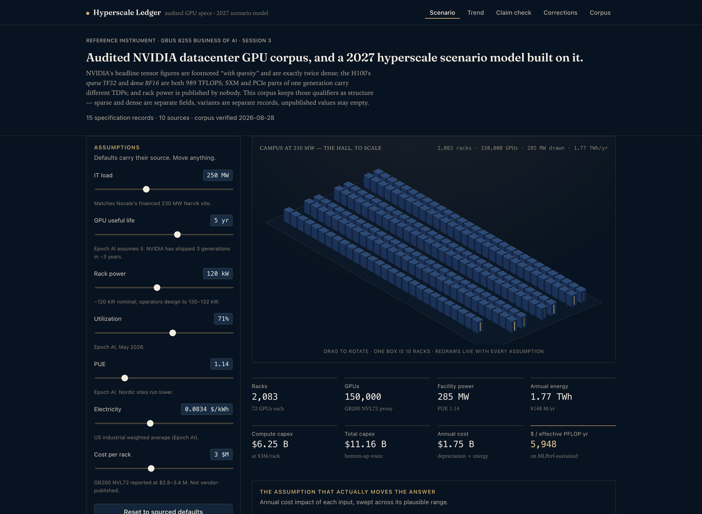
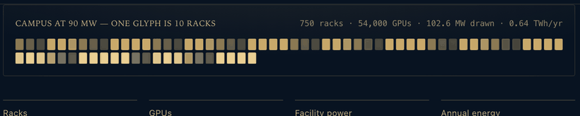

<div align="center">

# Hyperscale Ledger

**An audited specification corpus for NVIDIA datacenter GPUs — and a 2027 hyperscale data-center scenario model built on top of it.**

[](https://bakulbadwal.github.io/hyperscale-ledger/)
[](specs.json)
[](METHOD.md)
[](LICENSE)

### [→ Open the live model](https://bakulbadwal.github.io/hyperscale-ledger/)



<br><br>



<sub><b>Every box is ten real racks.</b> The hall is drawn from the model, not decoration — <b>drag it to rotate on the live site</b>; it grows as IT load sweeps 90 → 570 MW, and the counts above it are live.</sub>

</div>

---

## Why this exists

Almost every published figure about AI hardware is correct on the vendor's page and wrong by the time it reaches a spreadsheet. Not because anyone is lying — because the numbers carry **qualifiers that compress away in prose**.

NVIDIA's headline tensor-core figures are footnoted *"with sparsity"* and are exactly **twice** the dense value. The H100's *sparse TF32* and its *dense BF16* are **both 989 TFLOPS**, so the two get conflated constantly. SXM and PCIe parts of the same generation have different TDPs. Rack power has a nominal figure and an observed one, 10% apart — and NVIDIA publishes neither.

Get one of those wrong and a data-center model is off by a factor of two while looking entirely plausible.

So this repo does two things:

1. **[`specs.json`](specs.json)** — a corpus where sparse and dense are separate fields, variants are separate records, every value carries a source URL and an access date, and unpublished values are `null` rather than guessed.
2. **A scenario model** on top of it, which makes the load-bearing assumptions manipulable so they can be argued with instead of taken on faith.

## The five views

| | View | What it does |
|---|---|---|
| [🔗](https://bakulbadwal.github.io/hyperscale-ledger/#scenario) | **Scenario** | A 250 MW AI campus on GB200 NVL72. Flex GPU useful life, rack power, utilization, power price and rack cost; watch capex, TCO and $/effective-PFLOP move. A tornado chart ranks what actually drives the answer. |
| [🔗](https://bakulbadwal.github.io/hyperscale-ledger/#trend) | **Trend** | Huang's Law re-derived on **dense FP16/BF16, flagship SXM parts only** — precision held fixed — against the marketing curve and Epoch AI's measured ~2.5-year doubling. |
| [🔗](https://bakulbadwal.github.io/hyperscale-ledger/#check) | **Claim check** | Paste a FLOPS or TDP figure; it reports every part, precision and variant the number is consistent with, and flags the ambiguity. Try `989`. |
| [🔗](https://bakulbadwal.github.io/hyperscale-ledger/#corrections) | **Corrections** | Published claims that do not survive checking — including the GPU power table in Ch. 19 of *The Thinking Machine*. |
| [🔗](https://bakulbadwal.github.io/hyperscale-ledger/#corpus) | **Corpus** | The whole dataset, inspectable, with every source and access date. |

## Findings

**Huang's Law holds — and the published curve still overstates it.** On a fixed-precision basis (V100 → B200, dense BF16 throughout) this line doubles every **1.68 years**, comfortably inside the "more than double every two years" claim. On the headline basis it doubles every **0.98 years** — a curve **1.72× steeper**. That gap is not silicon; it is number formats getting narrower and sparsity being counted, roughly **42%** of the apparent gain.

**Depreciation dominates energy.** On a 250 MW campus, moving GPU useful life from 5 years to 3 swings annual cost by about **$833 M** — roughly **5.6× the entire annual electricity bill** at US industrial rates. The AI-capex debate is conducted almost wholly in the language of power; power is the second-order term.

**The most load-bearing input in the model is not vendor-published.** NVIDIA states **no rack power figure at all** for GB200 NVL72 — not on the product page, not in the Blackwell datasheet. The universally-quoted 120 kW is trade press; 132 kW is a Vertiv reference architecture.

**A newer generation is not uniformly faster.** Blackwell Ultra (GB300) is roughly **30× slower than Blackwell at INT8 and at FP64** — die area reallocated toward FP4/FP6. "GPU performance" is not one number, and any single-number trend implicitly picks a precision.

**Nameplate overstates delivered throughput by ~2.55×, not the ~5× usually quoted.** Peak *dense FP8* is ~750 EFLOPS against ~294 EFLOPS MLPerf-sustained. The larger figure comes from comparing an FP4 nameplate against an FP8 measurement — a precision mismatch, not a utilization finding. *(My own first draft made exactly this error. It was caught on adversarial review and is now documented as failure mode #2 on the site.)*

**The assigned book's power table mixes product lines.** Witt's Ch. 19 ladder quotes four *real* NVIDIA TDPs, but 250 W is the A100 40GB PCIe and 350 W the H100 NVL, while the last two rungs are flagship parts. Like-for-like it is a 2.5× rise, not 4×.

## Provenance

Every value is tagged:

| Tag | Meaning |
|---|---|
| **`F`** | Vendor-published — nvidia.com or an NVIDIA-authored datasheet. Mirrors flagged explicitly. |
| **`R`** | Credible secondary — named and linked. Never presented as vendor-published. |
| **`T`** | My own inference or model output. Always visibly separated. |
| `null` | Not published. Left empty on purpose, never filled from memory. |

The corpus was built by **parallel subagents against a fixed schema**, one per GPU generation, forbidden from estimating. The **A100 and H100 records — the two the analysis leans on hardest — were transcribed twice, independently, and diffed.** A final adversarial verification pass recomputed every figure and re-fetched every cited page; it returned three blocking errors, all corrected here.

Full methodology, including the sparse/dense handling and the fixed-precision comparison rule, is in **[METHOD.md](METHOD.md)**.

## Architecture

No framework, no build step, no dependencies — plain HTML/CSS/JS, so it runs anywhere with nothing to install.

| File | Role |
|---|---|
| [`specs.json`](specs.json) | The corpus. Every fact, with provenance. The only file that changes when hardware ships. |
| [`index.html`](index.html) | Page shell. No factual content. |
| [`app.js`](app.js) | Fetches the corpus, renders the five views, runs the model arithmetic — deliberately simple enough to audit by reading. |
| [`styles.css`](styles.css) | Design language — deep navy, brass accent, warm paper ink, Fraunces display serif, carried over from [ai-stack-field-atlas](https://github.com/bakulbadwal/ai-stack-field-atlas). |

`app.js` fetches `specs.json`, so `file://` fails on CORS. Serve it:

```bash
python3 -m http.server 8000
```

Every view is hash-addressable — `#trend`, `#corrections` — and every model input can be preset from the query string, so a specific case is linkable: [`?it_mw=400&gpu_life=3`](https://bakulbadwal.github.io/hyperscale-ledger/?it_mw=400&gpu_life=3).

## Honest limits

- NVIDIA datacenter parts only. No AMD Instinct, no TPU, no Trainium.
- Rack pricing is secondary-sourced everywhere and marked as such; NVIDIA publishes none.
- MLPerf figures reflect one benchmark, one model, one scale — the run behind the 39% figure was ~2,500 GPUs, which says nothing about a 150,000-GPU fabric.
- The scenario model is simple enough to audit by reading, which also means it is not a substitute for an operator's pro forma.
- Vera Rubin figures carry NVIDIA's own *"preliminary, subject to change"* footnote.

---

<div align="center">

Built by **[Bakul Badwal](https://www.linkedin.com/in/bakulbadwal/)** — MBA Candidate, UVA Darden, Class of 2027 — with [Claude Code](https://claude.com/claude-code).
<br>For **GBUS 8255 — Business of AI Reading Seminar** (Laseter) · Session 3, *The Thinking Machine* (Stephen Witt)
<br>Companion to **[The AI Stack Field Atlas](https://github.com/bakulbadwal/ai-stack-field-atlas)** · MIT licensed

</div>
